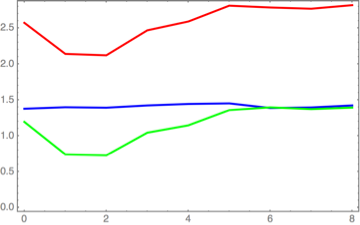
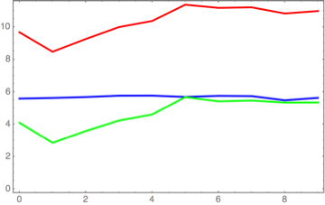
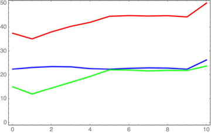
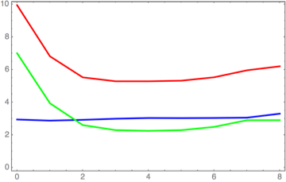
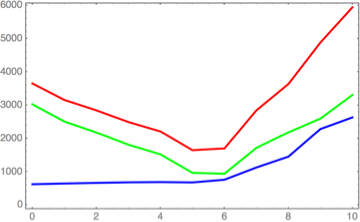

# GIGO

Copyright &copy; 2012 Robert Kooima

GIGO is set of command line utilities providing basic image processing functionality and emphasizing frequency-domain operations. Using out-of-core data access, GIGO is limited only by available disk space. With a pervasive multi-core implementation, GIGO is readily capable of processing gigapixel images in short order, and terapixel images in time.

All operations are performed using an on-disk cache file with power-of-two width and height, power-of-two-sized tile layout, and either one or three 32-bit floating point complex samples. The cache file format is raw binary, and image meta-data is provided via command line arguments.

## Command line arguments

All utilities accept the following arguments. These are optional, as most missing image meta data can be guessed from the cache file size.

-   `-l size`

    Log 2 tile size. This is the one parameter that can never be guessed from file size, and it defaults to zero (thought it should probably default to 5, see below).

-   `-n height`

    Log 2 image height.

-   `-m width`

    Log 2 image width.

-   `-p samples`

    Samples per pixel.

-   `-t`

    Print execution times at exit.

## Image conversion

    convert [-tve] [-l tile] input.tif output
    convert [-tr]  [-l tile] [-n height] [-m width] [-p samples] input output.tif

Convert a TIFF image file to a new image cache, or vice-verse. The intended direction is selected by the file extension of the first file name argument, and TIFF is recognized as `.tif`, `.TIF`, `.tiff`, or `.TIFF`.

-   `-v`

    When converting TIFF to image cache, print the cache paramaters to stdout to be received by GIGO scripting tools. Output will include the cache file name, the log 2 tile size, image height, and image width, and finally the sample count.

-   `-e`

    When converting TIFF to image cache, extend the image vertically with a rotated copy. This doubles the pixel count but makes a sphere map periodic in latitude, which is required for correctness of most frequency-domain operations.

    When converting image cache to TIFF, discard the entension.

-   `-r`

    When converting an image cache to TIFF, include only the real magnitude of each complex sample value.

## Cache Initialization

    reserve [-t1] [-l tile] [-n height] [-m width] [-p samples] image

Create a new image cache with the given parameters, initialized to zero (default) or one.

-   `-1`

    Initialize to one.

## Fourier transform

    fourier [-ITt] [-l tile] [-n height] [-m width] [-p samples] image

Perform a one-dimensional fast Fourier transform in-place on the named image cache file, either forward (default) or inverse, and either row-wise (default) or column-wise. A two-dimensional Fourier transform is the result of a row-wise FFT followed by a column-wise FFT.

-   `-I`

    Perform an inverse Fourier transform (synthesis).

-   `-T`

    Perform a transposed (column-wise) Fourier transform.

## Filtering

    filter [-tRTHGBgI] [-x X] [-y Y] [-r radius] [-w width]
           [-l size] [-n height] [-m width] [-p samples] image

Filter a frequency-domain image in-place using one of several window functions. Filter position, radius, and width are floating point values in pixels (except where noted).

-   `-x X`

    X position of the filter center. Default is the image center.

-   `-y Y`

    Y position of the filter center. Default is the image center.

-   `-r radius`

    Filter radius.

-   `-w width`

    Filter width.

-   `-R`

    Rectangular window. Radius is exact and width is unused.

-   `-T`

    Triangular window. Radius gives the midpoint (50% cut-off). Width gives the exact width of the linear interpolation. If radius is greater than half the width then this will give a trapezoidal window.

-   `-H`

    Hann window. The radius gives the midpoint (50% cut-off). Width gives the exact width of the cosine interpolation.

-   `-G`

    Gaussian window. Radius gives the standard deviation (in pixels) and width is unused. If the desired effect is that of a normalized spatial-domain Gaussian kernel with standard deviation `s`, the equivalent unit-height frequency-domain Gaussian window has standard deviation `r = (2**n) / (pi * s)`.

-   `-B`

    Butterworth filter. Radius gives the cut-off frequency and width gives the filter order (which is classically an integer).

-   `-I`

    Invert the chosen window function, giving a high-pass filter instead of a low-pass. The sum of the frequency responses of a low-pass and a high-pass filter with the same parameters is guaranteed to be one everywhere. Tight, off-center, inverse filters are useful for eliminating unwanted spikes in the frequency domain.

## Kernel Generation

    kernel [-tgc] [-r radius] [-l size] [-n height] [-m width] [-p samples] dst

Fill the destination image cache with a selected kernel type. The kernel will be centered at the origin and will wrap around both axes.

-   `-g`

    Gaussian kernel. Radius gives the standard deviation in pixels. The integral is one.

-   `-c`

    Circular kernel. Radius is given in pixels. The integral is one.

## Computation

    compute [-t] [-l tile] [-n height] [-m width] [-p samples] op [arg] dst [src]

Perform per-pixel complex arithmetic in-place. Source and destination caches must have the same parameters. Available `op [arg] dst [src]` patterns are as follows.

-   `-M dst src`

    Multiplication. Destination = destination &times; source.

-   `-D dst src`

    Division. Destination = destination &divide; source.

-   `-A dst src`

    Addition. Destination = destination + source.

-   `-S dst src`

    Subtraction. Destination = destination - source.

-   `-P dst src`

    Power. Destination = destination ^ source.

-   `-x dst src`

    Minimum. Destination gets the smaller (by absolute value) of destination and source.

-   `-X dst src`

    Maximum. Destination gets the larger (by absolute value) of destination and source.

-   `-I dst`

    Inverse. Destination = 1.0 - destination.

-   `-L dst`

    Natural logarithm. Destination = ln destination.

-   `-E dst`

    Exponential. Destination = e ^ destination.

-   `-N dst`

    Test non-zero. Destination gets 1.0 if the absolute value is greater than zero, 0.0 otherwise.

-   `-i coeff dst src`

    Destination gets the linear interpolation of destination and source.

-   `-w coeff dst src`

    Destination gets the Wiener deconvolution of the destination using the kernel given by source.

-   `-s coeff dst`

    Scalar. Destination = destination * coeff.

-   `-r min dst`

    Image is thresholded to 1.0 if its absolute value is greater than or equal to `min`, 0.0 otherwise.

-   `-R max dst`

    Image is thresholded to 1.0 if its absolute value is less than or equal to `max`, 0.0 otherwise. Minimum and maximum thresholding may be used simultaneously to extract a middle range of values.

## Measurement

    measure [-t] [-l size] [-n height] [-m width] [-p samples] op src

Perform a measurement and print the value for each sample.

-   `-s`

    Sum all pixels.

-   `-x`

    Find the minimum value of all pixels.

-   `-X`

    Find the maximum value of all pixels.

## Pixel transfer

    transfer [-t] -x X -y Y -X X -Y Y -W width -H height
             [-l size] [-n height] [-m width] [-p samples]
             [-L size] [-N height] [-M width] [-P samples] dst src

Copy a block of pixels from one image cache to another. The destination must already exist and should first be initialized if a new output is to be generated.

-   `-x X`

    Destination region X.

-   `-y Y`

    Destination region Y.

-   `-X X`

    Source region X.

-   `-X Y`

    Source region Y.

-   `-W width`

    Source region width.

-   `-H height`

    Source region height.

-   `[-l size] [-n height] [-m width] [-p samples]`

    Destination image cache parameters (as standard).

-   `[-L size] [-N height] [-M width] [-P samples]`

    Source image cache parameters.

## Tile size

The selection of an optimal tile size parameter `-l` depends almost entirely upon whether or not the image cache file fits in RAM. However, there is a simple choice that works in most cases: 5.

To elaborate, several 2D Fourier transforms were performed on images of various sizes, using tiles of various sizes, on a 16-core Intel Xeon with 32GB of RAM and an SSD for scratch space. The following three series of tests use image sizes that fit comfortably in RAM.

Here, an 8192 x 4096 image (250 MB) is transformed using tile sizes 1 x 1 through 256 x 256. The blue line gives the time in seconds to perform the row-wise FFT, the green line gives the column-wise FFT, and the red line gives the total run time. All times are the average of three runs. Discussion follows.

Here, a 16384 x 8192 image (1 GB) is transformed using tile sizes up to 512 x 512. The maximum tile size is always four powers of two less than the image height because there are 16 processor cores. Work is distributed among these cores in rows of tiles.

Finally, a 32768 x 16384 image (4 GB) is transformed using tile sizes up to 1024 x 1024.

The profiles of all three sets of results are similar. The costs of the row-wise and column-wise transforms match beyond some tile size (a function of thread count.) Performance continues to degrade slowly with increasingly large tiles as resident set sizes increase and CPU caches begin to take the strain.

In general, row-wise transformation benefits straightforwardly from locality of reference. Each compulsory CPU cache miss sets up a long string of hits, giving level performance across most tile sizes. Column-wise transformation also benefits from locality of reference, but in a more subtle fashion. A miss sets up an equal number of future hits, but only a few for the working thread. Neighboring threads receive the benefit instead, and all threads end up priming the cache for one another.

At first glance, the discrepancy between row-wise and column-wise performance would seem easy to explain: the FFT is O(n log n) and the image is twice as wide as it is high so the row-wise transform should take more than twice as long as the column-wise. Yet computation is fast, and data access is slow, the two orientations achieve parity for large tiles, and the discrepancy persists even with a square image. Indeed, the cross-thread cache behavior appears to be of greater benefit than basic row-wise cache coherence. The effect is real and can be demonstrated to disappear when only a single thread is launched.

This is a re-run of the 8192 x 4096 case using only a single thread. Column-wise transformation suffers badly due to lost cache priming.

Here, a 131072 x 65536 image (64 GB) is transformed using tile sizes up to 1024 x 1024. It paints a very different picture, as this image does not fit in RAM. With each page cache miss on a small tile, a 4 KB page is loaded from the cache file by the OS virtual memory mechanism. Due to the small tile size, this incoming page is likely to include many row-neighboring tiles, but no column-neighboring tiles. There is thus no  locality of reference during the column-wise transform, and performance suffers relative to row-wise. This is VRAM behavior, not CPU cache behavior, so every miss hurts badly.

A 32 x 32 tile is 8 KB in size and is the smallest tile size larger than one page of VRAM. This represents a breaking point where the paging mechanism ceases to work against column-wise access. The performance of the row-wise and column-wise transforms immediately achieve parity. As tile sizes grow, job sizes increase and CPU caches suffer, as above.

So the answer is 5. When the image fits in RAM, a 32 x 32 tile gives parity in the performance of the row-wise and column-wise transforms, and thus level performance for most thread counts. When the image does not fit in RAM, a 32 x 32 tile gives optimal cache coherence. Smaller tiles kill performance for low thread counts or large images, while larger tiles incur large resident sets, tax the CPU cache hierarchy, and give no benefit.

It is worth noting that a tile size of 1 x 1, the flat raster case, is never an optimal choice. While transforms of in-memory images benefit slightly from the elimination of inner loops that a unit tile would allow, the loss of column-wise locality of reference undoes the advantage. 1 x 1 tiles may enhance cross-pollination in large thread sets but cause a single thread to thrash. Most significantly, when the image cache exceeds the available RAM, an optimally-tiled layout can give double the performance of a flat raster.
